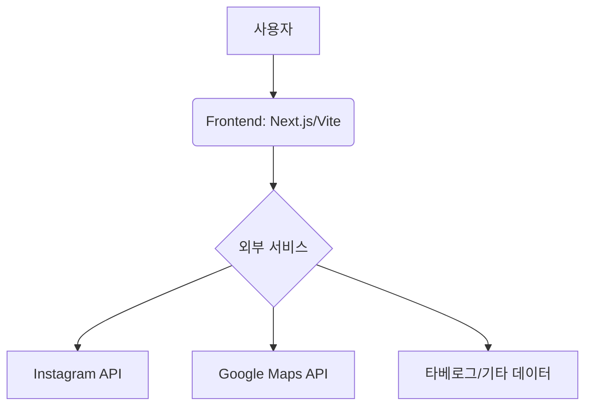
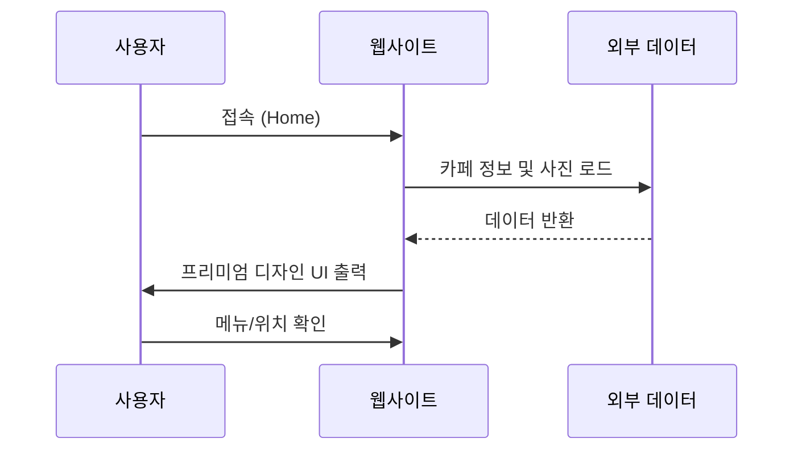

# 🏗️ 프로젝트 설계도 (Architecture & Design)

이 문서는 **noicoffee** 웹사이트의 구조와 디자인 설계를 기록하기 위한 파일입니다.  
Mermaid 차트를 사용하여 시각적인 설계도를 추가하거나, 텍스트로 상세 사양을 정의할 수 있습니다.

---

## 1. 개요 (Overview)
- **프로젝트 명**: noicoffee 웹사이트
- **목적**: 삿포로 소재 "noicoffee" 카페를 위한 프리미엄 홍보 및 정보 제공 웹사이트
- **주요 기능**:
    - 카페 소개 및 메뉴 정보
    - 인스타그램 연동 및 타베로그 정보 제공
    - 위치 정보 (Google Maps)

## 2. 시스템 아키텍처 (System Architecture)

## 3. 사용자 흐름 (User Flow)

## 4. 디자인 시스템 (Design System)
- **색상 팔레트 (Color Palette)**:
    - Primary: #CoffeeColor (예: HSL 25, 30%, 20%)
    - Accent: Gold/Cream
- **타이포그래피 (Typography)**:
    - Header: Inter / Roboto Serif
    - Body: Outfit
- **무드보드**: 차분하면서도 고급스러운 카페 분위기 (Glassmorphism, Soft Shadows)

## 5. 데이터 모델 (Data Model)
| 필드명 | 타입 | 설명 |
| :--- | :--- | :--- |
| cafe_name | String | 카페 이름 |
| location | String | 주소 및 좌표 |
| menu_items | List | 시그니처 메뉴 리스트 |

---

> [!TIP]
> 설계도가 수정될 때마다 이 파일을 업데이트하여 팀원(또는 AI 어시스턴트)과 일관된 방향을 유지하세요.
